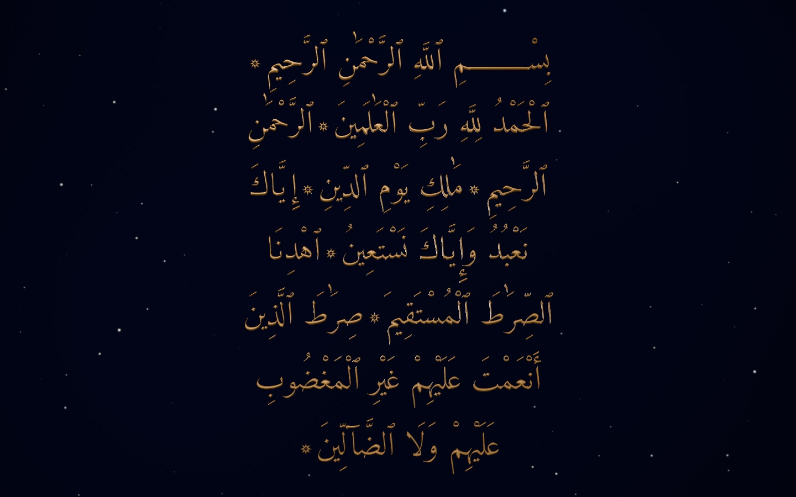
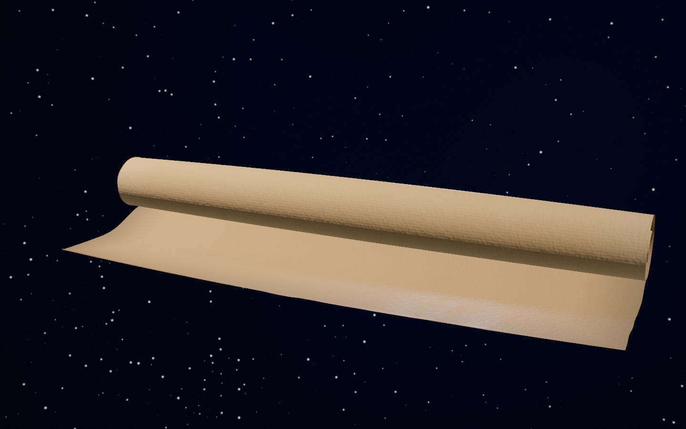
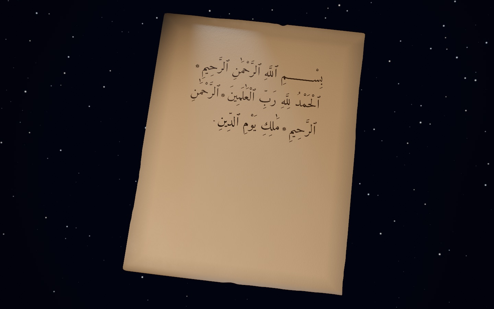
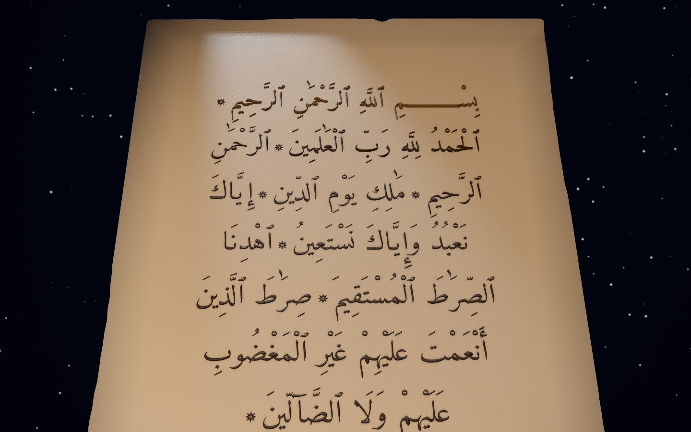

# Al-Fātiḥah · a manuscript in three dimensions

**Live:** https://jameel7007.github.io/fatihah-manuscript/

Sūrat al-Fātiḥah — the seven verses that open the Qurʾān — shown as a manuscript being made. A rolled
parchment rests in the dark. As you scroll, it unrolls, a scribe writes the seven āyāt in iron-gall ink,
the page is presented for reading, the letters swell into relief, and āyah by āyah the words stand up
from the page and turn to gold, until the gilded text faces you and holds.



| The rolled parchment | The scribe writes | The words rise |
|---|---|---|
|  |  |  |

Everything on screen is rendered live in the browser. Nothing is a video: every state is a pure function
of how far you have scrolled, so scrolling back replays it exactly.

## How it works, in plain language

- **One axis.** Scroll position becomes a number `p` from 0 to 1. Every part of the scene — the curl of
  the parchment, the ink, the camera, the lights, the height of the gold letters — is a function of `p`.
  There is no timeline and no recorded animation, which is why it can be scrubbed in either direction.
- **The parchment is a real surface.** A 192 × 256 grid is deformed every frame by an analytic curl
  (an Archimedean spiral that unwinds arc-length-preserving), with a small physically simulated residual
  ripple when you scroll fast. Its outline is drawn with authored flaws: a chip, a notch, four different
  corner radii.
- **The ink is written, not faded in.** The calligraphy is stored as a signed-distance field. A second
  channel stores stroke order, so the reveal sweeps along each stroke in the order a hand would write
  it. Wet ink is dark and glossy, then dries to matte brown; the edge bleeds slightly along the fibres.
- **The gold is geometry.** The same outlines are extruded into a mesh of about half a million
  triangles with a hand-drawn bevel profile (root fillet, drafted wall, burnished crown). It is born
  ink-coloured beneath the flat ink, so the hand-off from flat to raised has no visible seam, and
  turns to satin gold as each āyah rises.
- **Light does the reverence.** A warm key, a cool rim, a reflected window in the environment, soft
  contact shadows under the rising words, and a dark blue sky with tiny stars that keep clear of the text.
  Tone mapping is AgX; there is no bloom.
- **It adapts to the device.** Three quality tiers (desktop, iPhone 15 class, iPhone 12 class) pick the
  mesh, shadow filter and pixel density; a runtime monitor steps quality down if frames overrun. A poster
  image shows first, and the live canvas crossfades in once it has compiled.
- **It fails gracefully.** No WebGPU? The same node materials compile to WebGL2. No usable GPU at all?
  A folio of seven still plates. Prefer reduced motion? Seven held compositions with a pager and
  keyboard navigation.

## The text

The Arabic is the ʿUthmānic text in the reading of Ḥafṣ ʿan ʿĀṣim, as printed in the Madinah muṣḥaf,
taken from the [Tanzil](https://tanzil.net) project and verified letter for letter on every build
(`node build/verify-text.mjs`). The Basmalah is counted as āyah 1. The hand is
[Amiri Quran](https://github.com/aliftype/amiri) by Khaled Hosny (SIL Open Font License), shaped once
through HarfBuzz into a frozen, checksummed composition: a classical centred block of seven lines with
rosette āyah markers. The English on the page follows Marmaduke Pickthall's 1930 translation
(public domain).

## Built with

Three.js r185 `WebGPURenderer` with TSL node materials (WebGL2 fallback from the same graph), TypeScript
strict, Vite. No other runtime dependencies. The asset pipeline (text shaping, ink atlases, glyph meshes)
is deterministic Node.

## Run it

```bash
npm install
npm run dev        # http://localhost:4520
npm run build      # production build → dist/
npx vite preview --port 4521
```

Deployment is a GitHub Actions workflow (`.github/workflows/pages.yml`) that verifies the text, builds
with `FATIHAH_BASE=/fatihah-manuscript/`, and publishes `dist/` to GitHub Pages on every push to `main`.

## Quality

- 74 reference frames (12 scroll positions × 3 tiers × 2 backends, plus one isolation frame) are blessed
  as PNGs and checked by a headless harness: `node qa/verify-references.mjs --verify`. A frame passes
  bit-exactly or within a tolerance derived from measured GPU noise (changed pixels ≤ 1 %, median ΔE76
  ≤ 1.0, worst 5 × 5 block ≤ 4.0).
- `node --test qa/*.test.mjs` covers the tier monitor, the supersample governor, the performance audit
  and asset loading. Runner pages under `/qa/` exercise accessibility (66 checks), the fallback folio
  (17 checks), the full matrix and cold-load repeatability.
- The design contract and its revision history live in [docs/spec.html](docs/spec.html); the build
  ledger, decisions and evidence in [docs/status.html](docs/status.html); the engineering handbook
  (URL switches, capture rig, device runs, headless procedure) in [docs/engineering.md](docs/engineering.md).

## Repository map

| Path | What |
|---|---|
| `src/director/` | scroll axis, camera, drivers, idle motion, reduced motion, the page layer of words |
| `src/field/` | the parchment surface: analytic curl, residual solver, silhouette |
| `src/ink/` | signed-distance ink, stroke-order reveal, the ink render pass |
| `src/relief/` | the gold glyph mesh and contact shadows |
| `src/look/` | materials, textures, sky, dust, tone-mapping grade |
| `src/core/` | renderer boot, quality tiers, base-aware asset URLs |
| `build/` | text verification, shaping, atlas and mesh builders; evidence indexes |
| `qa/` | capture rig, reference gate, tests, runner pages, review frames |
| `public/text/` | the frozen composition, ink atlases and glyph meshes |
| `docs/` | specification, ledger, engineering handbook, next steps |

## Credits

Calligraphic hand: Amiri Quran, Khaled Hosny, SIL OFL 1.1. Text: Tanzil Uthmani. Translation: Marmaduke
Pickthall, 1930. Made by Thomas Mooney ([@Jameel7007](https://github.com/Jameel7007)).
